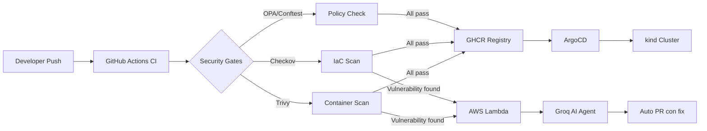

# 🚀 AI-Powered GitOps Platform

> TFM — Máster Multicloud & DevOps

Pipeline GitOps completo con Policy-as-Code, Security Scanning automatizado y un Agente de IA que detecta vulnerabilidades y abre Pull Requests de remediación de forma autónoma.

## 🏗️ Arquitectura

## 🛠️ Stack

| Capa | Tecnología |
|------|-----------|
| GitOps | ArgoCD + Kustomize |
| CI/CD | GitHub Actions |
| Registry | GitHub Container Registry |
| IaC | Terraform + AWS |
| Security | Trivy + Checkov + Syft |
| Policy | OPA + Gatekeeper + Conftest |
| AI Agent | AWS Lambda + Groq (Llama 3.3 70B) |

## 📋 Estado del proyecto

- [ ] Fase 1 — GitOps Foundation
- [ ] Fase 2 — Security Scanning
- [ ] Fase 3 — Policy-as-Code
- [ ] Fase 4 — AI Agent
- [ ] Fase 5 — Documentación
