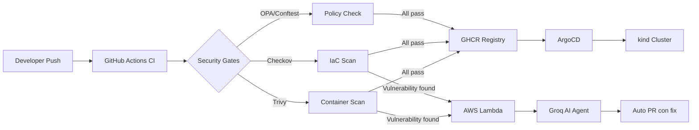

# 🚀 AI-Powered GitOps Platform

> TFM — Máster Multicloud & DevOps

Pipeline GitOps completo con Policy-as-Code, Security Scanning automatizado y un Agente de IA que detecta vulnerabilidades y abre Pull Requests de remediación de forma autónoma.

## 🏗️ Arquitectura

## 🛠️ Stack

| Capa | Tecnología |
|------|-----------|
| GitOps | ArgoCD + Kustomize |
| CI/CD | GitHub Actions |
| Registry | GitHub Container Registry |
| IaC | Terraform + AWS |
| Security | Trivy + Checkov + Syft |
| Policy | OPA + Gatekeeper + Conftest |
| AI Agent | AWS Lambda + Groq (Llama 3.3 70B) |

## 📋 Estado del proyecto

- [x] Fase 1 — GitOps Foundation ✅
- [x] Fase 2 — Security Scanning ✅
- [x] Fase 3 — Policy-as-Code ✅
- [x] Fase 4 — AI Agent ✅
- [ ] Fase 5 — Documentación

## 🚀 Setup rápido

    # 1. Levantar el clúster
    kind create cluster --config kind-config.yaml

    # 2. Instalar ArgoCD
    helm repo add argo https://argoproj.github.io/argo-helm
    helm install argocd argo/argo-cd --namespace argocd --create-namespace

    # 3. Acceder a ArgoCD
    kubectl port-forward svc/argocd-server -n argocd 8080:80

    # 4. Infraestructura AWS
    cd infra/aws && terraform apply

## 📁 Estructura del repositorio

    tfm-gitops-platform/
    ├── apps/demo-web/        # Aplicación demo (Flask + Docker)
    ├── k8s/                  # Manifiestos Kubernetes (Kustomize)
    │   ├── base/             # Definición base
    │   └── overlays/dev/     # Configuración de entorno dev
    ├── infra/aws/            # Infraestructura AWS (Terraform)
    ├── policies/             # Políticas OPA/Rego
    ├── agent/                # Agente IA (Python)
    └── .github/workflows/    # Pipelines CI/CD
